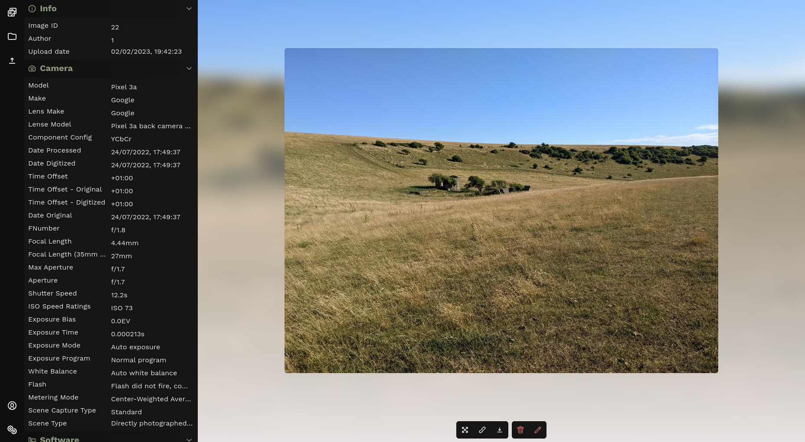

    
    <h1>OnlyLegs</h1>
    
Gallery built for fast and simple image management

 

## Features
### Currently implemented
- Easy uploading and managing of a gallery of images
- Multi user support, helping you manage a whole group of photographers
- Custom CSS support

### Coming soon tm
- Image groups, helping you sort your favorite memories
- Password locked images/image groups, helping you share photos only to those who you want to
- Logging and automatic login attempt warnings and timeouts
- Searching through tags, file names, users (and metadata maybe, no promises)

## screenshots

Homescreen

Image view

## Running
Currently only for reference

    poetry install
    poetry run python3 -m flask --app gallery --debug run --host 0.0.0.0
    poetry run python3 -m gunicorn -w 4 -b 0.0.0.0:5000 'gallery:create_app()'