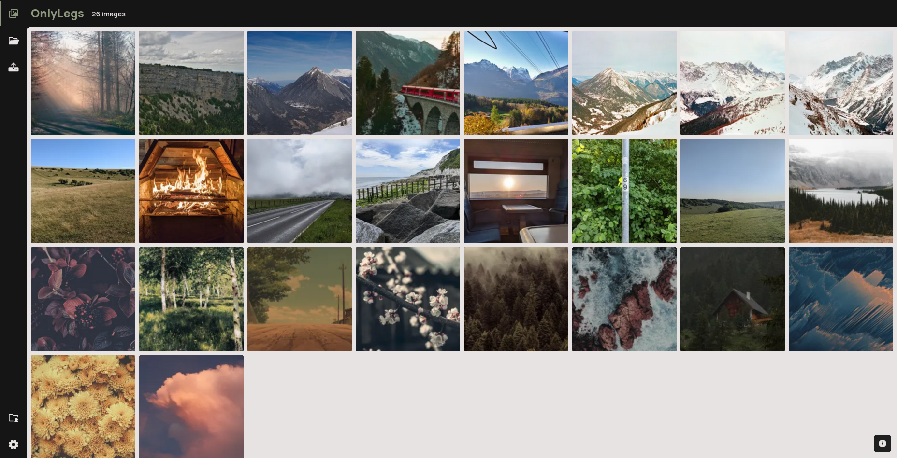

    
    

        <ul>
            
<h1 style="display: inline-block;">OnlyLegs</h1>

        </ul>
    

    
Gallery built for fast and simple image management

    
    
    
    
    

## Features
 - [x] Easy uploading and managing of a gallery of images
 - [x] Multi-user support, helping you manage a whole group of photographers
 - [x] Image groups, helping you sort your favourite memories
 - [x] Custom CSS support
 - [ ] Password locked images/image groups, helping you share photos only to those who you want to
 - [ ] Logging and automatic login attempt warnings and timeouts
 - [ ] Searching through tags, file names and users

And many more planned things!

## screenshots

Home-screen

Image view

## Running

You first need to install `python poetry`, it's best to follow their getting started guide you can find on the official website.

Next we need to install the required packages for the gallery to function correctly, make sure you're in the directory of the project when you run this command:

    poetry install

By default, the app runs on port 5000, 4 workers on `gunicorn` ready for you to use it. You can find more information on this using the `-h` flag. But to run the gallery, use this command.

    poetry run python3 run.py

Now follow the provided prompts to fill in the information for the Admin account, and you're ready to go!

### Common issues
#### App failing to create a user config folder

Try checking if you have `XDG_CONFIG_HOME` setup. If you don't, you can set that with this command:

    export XDG_CONFIG_HOME="$HOME/.config"

## Final notes

Thank you to everyone who helped me test the previous and current versions of the gallery, especially critters:

 - Carty
 - Jeetix
 - CRT
 - mrHDash
 - Verg
 - FennecBitch

Enjoy using OnlyLegs!